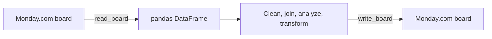

# pandas-monday

**Move Monday.com board data into pandas, transform it, and write it back.**

[](https://www.python.org/)
[](https://pandas.pydata.org/)
[](LICENSE)

`pandas-monday` wraps the Monday.com GraphQL API with a DataFrame-oriented
interface. Read a board into pandas, use the normal pandas toolchain, and write
the result back without maintaining GraphQL query strings in application code.



## Capabilities

- Read boards into pandas DataFrames.
- Include subitems when reading.
- Select and order board columns.
- Write DataFrames back in append or replace workflows.
- Archive or delete replaced items when explicitly requested.
- Convert common Monday.com values to DataFrame-friendly representations.
- Surface authentication, API, board, and column-order errors as package exceptions.

## Install

The package is currently installed from source rather than PyPI:

```bash
git clone https://github.com/wtbates99/pandas-monday.git
cd pandas-monday
python -m pip install -r requirements.txt
```

Run scripts from the repository root so Python can import the local
`pandas_monday` package.

## Authenticate

Prefer an environment variable so tokens do not enter source files or shell
history:

```bash
export MONDAY_API_TOKEN="your-token"
```

```python
import pandas_monday as pm

client = pm.monday_pandas()
```

An explicit token is also accepted:

```python
client = pm.monday_pandas(api_token="your-token")
```

## Read a board

```python
import pandas_monday as pm

client = pm.monday_pandas()

df = client.read_board(
    board_id="1234567890",
    include_subitems=True,
    columns=["name", "status", "numbers"],
)

print(df.head())
```

## Transform and write

```python
import pandas as pd
import pandas_monday as pm

client = pm.monday_pandas()
df = pd.read_csv("normalized-projects.csv")

client.write_board(
    board_id="1234567890",
    df=df,
    mode="replace",
    overwrite_type="archive",
)
```

`replace` is destructive to the target board's current item set. Use a test
board first, prefer `archive` over `delete`, and verify the DataFrame before
writing.

## Development

```bash
python -m pip install -r requirements.txt
python -m pip install pytest
python -m pytest pandas_monday/tests
```

Tests mock Monday.com responses and do not require a real API token.

## Status

The library covers the board and column types represented in its test suite.
Monday.com's API evolves independently, so validate new column types and
high-volume board behavior before production use.

## License

`pandas-monday` is **source available** under the
[PolyForm Noncommercial License 1.0.0](LICENSE). Personal and noncommercial
use is permitted under those terms. Commercial use requires a
[separate license](COMMERCIAL-LICENSE.md).

Earlier revisions remain governed by the terms under which they were
published; see [license history](LICENSE_HISTORY.md).
